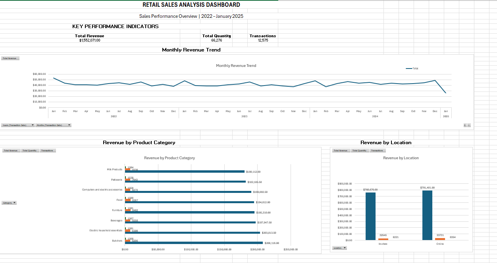
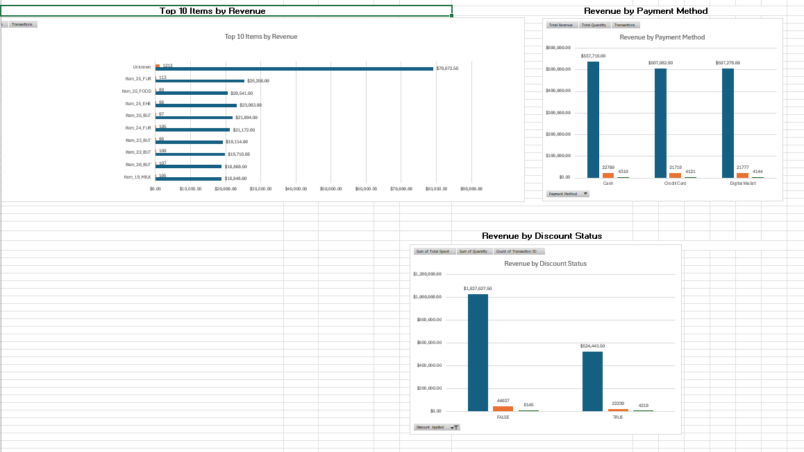
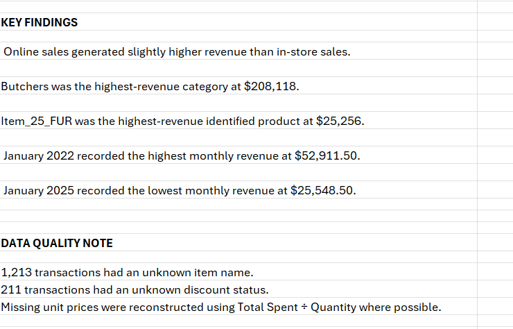

# Retail Sales Analysis 📊

## Project Overview

This project analyzes retail transaction data to identify sales trends, product performance, customer behavior, payment preferences, and discount patterns.

The project focuses on data cleaning, data quality handling, exploratory analysis, Pivot Table analysis, and dashboard creation using Microsoft Excel.

---

## Business Objectives

The main objectives of this project are:

- Analyze overall retail sales performance
- Identify the highest-performing product categories
- Compare online and in-store revenue
- Analyze revenue by payment method
- Identify monthly sales trends
- Identify top-performing products
- Analyze customer revenue contribution
- Analyze discounted vs non-discounted transactions
- Identify and document data-quality issues

---

## Dataset

The dataset contains retail transaction records with information such as:

- Transaction ID
- Customer ID
- Category
- Item
- Price Per Unit
- Quantity
- Total Spent
- Payment Method
- Location
- Transaction Date
- Discount Applied

The dataset contains **12,575 transactions** after excluding the header row.

---

## Data Cleaning

The raw dataset contained missing values and inconsistent data patterns.

The following data-cleaning activities were performed:

- Checked missing values across all columns
- Identified missing item names
- Identified missing unit prices
- Identified missing quantities
- Identified missing total-spent values
- Reconstructed missing unit prices using:

  `Total Spent ÷ Quantity`

- Validated calculated values against existing transaction data
- Handled missing discount information
- Retained missing values where reliable reconstruction was not possible
- Created a cleaned dataset for analysis

---

## Data Quality Findings

The analysis identified several data-quality issues:

- **1,213 transactions** had an unknown item name.
- **211 transactions** had an unknown discount status.
- Missing unit prices were reconstructed using `Total Spent ÷ Quantity` where possible.
- Revenue and quantity data were available for approximately **95.20%** of transactions.

Missing values that could not be reliably reconstructed were retained rather than being replaced with arbitrary values.

---

## Key Performance Indicators

| KPI | Value |
|---|---:|
| Total Revenue | $1,552,071.00 |
| Total Quantity Sold | 66,276 |
| Total Transactions | 12,575 |
| Average Transaction Value | $129.65 |
| Average Quantity per Transaction | 5.54 |

---

## Analysis Performed

### 1. Category Performance

Revenue was analyzed across product categories.

**Highest-revenue category:**

> Butchers — **$208,118.00**

---

### 2. Location Performance

Sales were compared between online and in-store transactions.

| Location | Revenue |
|---|---:|
| Online | $791,401.00 |
| In-store | $760,670.00 |

Online sales generated slightly higher revenue than in-store sales.

---

### 3. Payment Method Analysis

Revenue was analyzed across:

- Cash
- Credit Card
- Digital Wallet

Cash generated the highest revenue among the three payment methods.

---

### 4. Monthly Sales Trend

Monthly revenue was analyzed from **January 2022 to January 2025**.

**Highest monthly revenue:**

> January 2022 — **$52,911.50**

**Lowest monthly revenue:**

> January 2025 — **$25,548.50**

---

### 5. Top Products by Revenue

The project analyzed the highest-revenue identified products.

The highest-revenue identified product was:

> Item_25_FUR — **$25,256.00**

Transactions with missing item names were classified as `Unknown` and were treated as a data-quality issue rather than a real product.

---

### 6. Customer Analysis

A Top 10 customer analysis was performed based on total revenue.

The highest-revenue customer was:

> CUST_24 — **$68,452.00**

---

### 7. Discount Analysis

Transactions were analyzed according to discount status.

| Discount Status | Transactions |
|---|---:|
| Discounted | 4,219 |
| Non-Discounted | 8,145 |
| Unknown | 211 |

---

## Dashboard

The Excel dashboard provides a consolidated view of the major findings.

### Dashboard Overview



### Detailed Analysis



### Key Findings & Data Quality



---

## Tools Used

- Microsoft Excel
- Pivot Tables
- Pivot Charts
- Excel formulas
- Data cleaning
- Data validation
- Data analysis
- Data visualization
- Git
- GitHub

---

## Project Structure

```text
retail-sales-analysis/
│
├── data/
│   └── retail_sales_raw.csv
│
├── excel/
│   └── retail_sales_analysis.xlsx
│
├── visualizations/
│   ├── dashboard_overview.png
│   ├── dashboard_details.png
│   └── dashboard_keyfindings.png
│
└── README.md
```

---

## 👩‍💻 Author

**Shradha Patil**

BCA Student | Aspiring Data Scientist

---

## ⭐ Acknowledgement

This project uses a retail sales dataset for practicing data cleaning, analysis, and visualization using Microsoft Excel.

---

## 📌 Project Highlights

- Cleaned and analyzed **12,575 retail transactions**
- Performed data cleaning and validation in Excel
- Created Pivot Tables and Pivot Charts
- Built a retail sales dashboard
- Analyzed sales trends, products, customers, payment methods, and discounts
- Identified key business insights and data-quality issues

---

## 🛠️ Skills Demonstrated

**Excel:**  
Data Cleaning • Data Validation • Formulas • Pivot Tables • Pivot Charts • Dashboard Development

**Data Analysis:**  
KPI Analysis • Trend Analysis • Category Analysis • Customer Analysis • Business Insights

**Tools:**  
Microsoft Excel • Git • GitHub

---

## License

This project was created for educational and portfolio purposes.